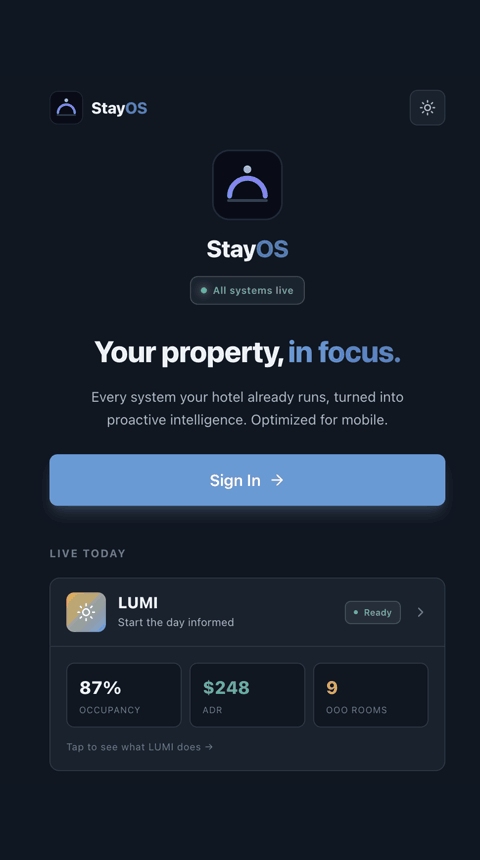

<p align="center">
  
</p>

# StayOS

**StayOS is the operating system for hotel General Managers and associates.** It is
a mobile-first platform that turns the data trapped across a property's disconnected
systems (PMS, Revenue Management, Loyalty/CRM, Facilities) into proactive,
AI-generated intelligence for the people who run the hotel.

> [!NOTE]
> This is a prototype — not a production deployment. It
> demonstrates the architecture for StayOS using real AWS services with mock
> operational data.

## Demo

<p align="center">
  
</p>

### Product Vision

Every hotel runs on disconnected systems, so operational intelligence reaches associates late, in fragments, and only if they go looking for it. StayOS is an attempt to close this gap: it reads the property's existing data through a unified API layer and turns it into proactive, AI-generated intelligence, delivered to the people who run the hotel, on mobile, before they need it.

In this repo, StayOS ships with **two live features** today, both aimed at the General Manager (GM) of a Property

-  **LUMI** starts the GM's day informed: a daily AI-generated brief (KPIs, VIP
  arrivals, overbooking risk, out-of-order rooms) delivered as a dashboard and a
  60-90 second AI-generated audio brief. If the GM needs more information, LUMI also provides a voice and chat interface.
-  **PULSE** takes the pulse of hotel operations and keeps the GM informed all day: real-time, tiered alerts (Critical / Warning / Info) pushed the moment a situation develops, each triaged by an AI agent that gathers the relevant property data and attaches a decision-ready brief, then resolved closed-loop — the GM approves, the agent executes. PULSE also looks *ahead*: a predictive Forecasting Agent runs on a daily schedule to warn the GM of likely room oversell before it happens (advisory, human-in-the-loop).

And features are coming. StayOS is built as a platform, not a single tool

Each app lives in its own top-level directory:

| App | Directory | What it does |
|---|---|---|
| **StayOS shell** | [`stayos-shell/`](stayos-shell/README.md) | Unified login + feature launcher grid; establishes the shared session (SSO) |
| **LUMI** | [`lumi/`](lumi/README.md) | Daily AI-generated GM brief (KPIs, VIP arrivals, overbooking risk, OOO rooms) as a dashboard + 60-90s audio brief, plus voice/chat Q&A agents over the same dataset |
| **PULSE** | [`pulse/`](pulse/README.md) | Real-time throughout-the-day tiered alerting (walk risk, VIP room readiness, complaint escalation) with agentic AI triage and closed-loop resolution, plus a predictive Forecasting Agent for room-oversell warnings (advisory) |


## Repository Layout

```
StayOS/
├── openapi.yaml   # Root API spec: documents the PULSE real-time alerts REST API (LUMI's API is in lumi/openapi.yaml)
├── stayos-shell/  # StayOS shell: unified login + feature launcher, served at /
├── lumi/          # Feature 1: daily GM brief (backend, frontend, infra, docs), served at /lumi
├── pulse/         # Feature 2: real-time alerting (backend, frontend, infra, docs), served at /pulse
└── shared/        # Cross-feature shared layer:
    ├── auth/                # @stayos/auth (shared SSO session)
    └── data-orchestrator/   # Unified Data Orchestrator (StackPrefix stayos-data):
                             # Step Functions state machine that owns the daily
                             # per-property roll-forward + PULSE baseline priming
```
## Deployment

This root README is the single source of truth for **deploying the whole
platform**. Each feature's own README covers only its feature-specific targets
and internals.

**Prerequisites** (one-time): AWS CLI v2.27+, Python 3.12+, Node.js 18+, and
Amazon Bedrock model access enabled in the target account/region (Claude Sonnet,
Nova Sonic, Polly). Region defaults to `us-east-1`.

```bash
git clone https://github.com/hemaljani/StayOS.git
cd StayOS
make deploy-all APP_PASSWORD=YourSecurePassword123!
```

Successful deployments are concise by default: the root pipeline prints eight
timed stages, bounded live progress such as CodeBuild, CloudFormation, Lambda,
Gateway, runtime, and frontend activity, and a short verification summary.
Complete command output is saved for every run at
`logs/deploy-<timestamp>.log`; set `VERBOSE=1` to stream that diagnostic output
to the console as well. `NO_COLOR=1` disables ANSI color, and CI environments
always receive stable line-oriented output. Use
`make deployment-summary-detailed` after deployment for runtime ARNs, artifact
locations, API endpoints, and application URLs.

LUMI's shared Python dependency layer is built remotely on AWS CodeBuild using
Lambda-compatible Python 3.12, Amazon Linux, and `x86_64`. Developers therefore
produce the same target-compatible layer from macOS, Linux, or Windows without
installing Docker. The build-input-fingerprinted layer artifact is reused until
its requirements or build definition changes.

## Deployment Pipeline

`make deploy-all` runs one ordered pipeline — each stage feeds the next, so
**PULSE is never deployed standalone**: it consumes outputs captured from the
LUMI deploy. In order, it deploys **LUMI → PULSE → Data Orchestrator**:

1. Deploy the **LUMI** stack (the shared foundation).
2. Capture LUMI's outputs (Cognito pool, the five operational-table stream ARNs,
   the shared Gateway endpoint, the Tool Lambda ARN) and deploy the **PULSE**
   stack with them threaded in.
3. Register PULSE's tools on the shared Gateway, build + deploy the Triage Agent,
   build + deploy the Forecasting Agent, wire both runtime ARNs into one final
   PULSE update, and publish the PULSE PWA to `/pulse`.
4. Publish the **StayOS shell** (login + feature launcher) to the distribution
   root (`/`).
5. Deploy the shared **Data Orchestrator** (`stayos-data`) — an additive
   roll-forward layer that primes today's data for every property.
6. Verify all stacks, required outputs, and runtime parameters, then print the
   deployed stacks, artifacts, runtimes, and real application URLs.

Two behaviors worth calling out:

- **The Data Orchestrator is additive** — it rolls data forward and lays down the
  PULSE baseline. It never re-seeds or bulk-rewrites the live dataset.
- **The platform is populated on first run** — every GM has a current daily brief
  immediately after `deploy-all`, no manual step. A per-property EventBridge
  schedule then re-anchors the window at each property's local midnight. As a
  safety net, the VIP-arrivals tool falls back to a live reservations query if a
  brief is ever missing, so it never reports a false "no VIP arrivals".

📖 **Further reading:** [`docs/deployment-pipeline.md`](docs/deployment-pipeline.md)
walks through the full eight-stage pipeline with a diagram, the Makefile structure,
every parameter, and failure-recovery steps.

> Run `make help` from the repo root for the full target list (per-feature
> deploys, tests, and `make data-<target>` for the orchestrator). See each
> feature's README for its own targets and internals.

## Teardown

`make destroy-all` is the mirror of `deploy-all` — it tears the whole platform
down in the **reverse** order (**Data Orchestrator → shell → PULSE → LUMI**, so
LUMI's shared foundation goes last). It is destructive and irreversible, so it is
guarded by an explicit confirmation:

```bash
# Tear down everything. CONFIRM=DESTROY is required (destructive, irreversible).
make destroy-all CONFIRM=DESTROY

# Target a specific AWS account / region:
make destroy-all CONFIRM=DESTROY PROFILE=my-other-account REGION=us-west-2
```

Each phase empties its S3 buckets and purges its ECR images before deleting the
stack (CloudFormation cannot delete a non-empty bucket/repo), and waits for the
delete to complete before the next phase runs.

📖 **Further reading:** [`docs/deployment-pipeline.md`](docs/deployment-pipeline.md#teardown)
covers the full reverse-order teardown — the per-phase breakdown, a diagram, the
standalone `make <feature>-destroy` commands, and failure recovery.

## Data Model

All features read from **one shared DynamoDB operational layer** owned by LUMI:
5 read-only dataset tables (`stayos-guests`, `stayos-rooms`,
`stayos-reservations`, `stayos-work-orders`, `stayos-revenues`) plus 2 LUMI
application tables (`stayos-briefs`, `stayos-settings`). PULSE adds its own
`pulse-*` tables (see [`pulse/README.md`](pulse/README.md)). The 5 dataset
tables are partitioned by `propertyId`, which is the data-isolation boundary
between properties (`stayos-settings` is keyed by `gmAlias`). They seed once and
are read-only at runtime (`Query`/`GetItem`) — the only runtime write-back is
PULSE's GM-approved closed-loop Action Executor — and they stream changes
(`NEW_AND_OLD_IMAGES`), which is what PULSE's rule engine evaluates to fire
real-time alerts.

The shared **Data Orchestrator** (`shared/data-orchestrator/`) re-anchors this
dataset daily: one per-property EventBridge schedule fires at each property's
local midnight and rolls the deterministic 30-day window forward via idempotent
upsert (pausing PULSE evaluation during the rewrite so no alert storm fires),
then regenerates that day's brief. It is additive and never bulk-rewrites or
re-seeds the live tables. See
[`docs/data-model.md`](docs/data-model.md) for the full model.

**The canonical schema reference is [`docs/data-model.md`](docs/data-model.md)**
— full table schemas, keys/GSIs, enumerated values, relationships, and seed
volumes. It is not duplicated here to avoid drift.

## Contributing

See [`CONTRIBUTING.md`](CONTRIBUTING.md).

## License

[MIT](LICENSE)

## References

- [AWS Well-Architected — Serverless Applications Lens](https://docs.aws.amazon.com/wellarchitected/latest/serverless-applications-lens/welcome.html)
- [Amazon Bedrock AgentCore — Runtime Developer Guide](https://docs.aws.amazon.com/bedrock-agentcore/latest/devguide/)
- [Amazon Bedrock AgentCore — Gateway (MCP tool targets)](https://docs.aws.amazon.com/bedrock-agentcore/latest/devguide/gateway.html)
- [Strands Agents SDK](https://strandsagents.com/)
- [Amazon Bedrock — Converse API](https://docs.aws.amazon.com/bedrock/latest/userguide/conversation-inference.html)
- [Amazon Nova Sonic — Bidirectional Streaming](https://docs.aws.amazon.com/nova/latest/userguide/speech.html)
- [Amazon Polly — Neural Voices](https://docs.aws.amazon.com/polly/latest/dg/ntts-voices-main.html)
- [DynamoDB Single-Table Design](https://docs.aws.amazon.com/amazondynamodb/latest/developerguide/bp-general-nosql-design.html)
- [Next.js 15 — App Router](https://nextjs.org/docs/app)
