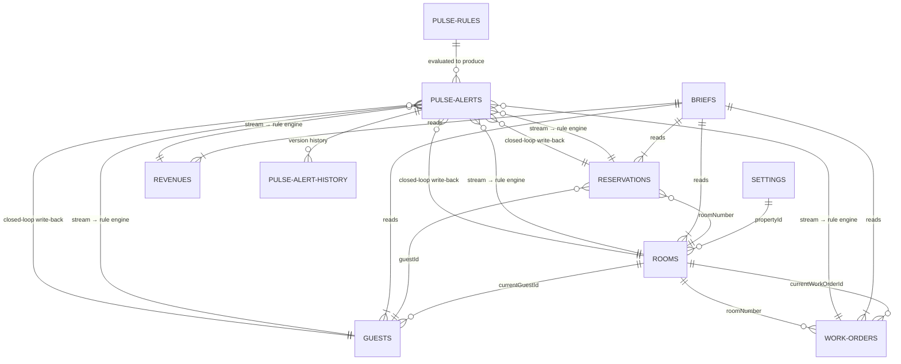
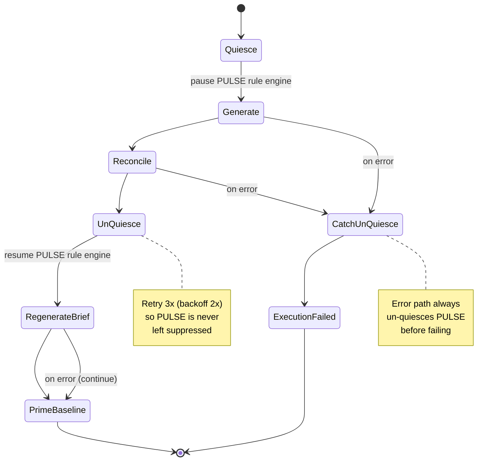

# StayOS — Data Model Reference

The canonical DynamoDB data-model reference for the whole StayOS platform. Two
layers on a single shared data foundation:

- **LUMI operational + application layer (7 `stayos-*` tables)** — 5 read-only
  dataset tables seeded once with ~24,000 items (30 days of deterministic hotel
  operations data across 5 pilot properties) plus 2 LUMI application tables. The
  5 dataset tables stream changes (`NEW_AND_OLD_IMAGES`).
- **PULSE feature layer (5 `pulse-*` tables)** — PULSE owns these; it never
  writes to the LUMI tables. PULSE's rule engine consumes the 5 dataset-table
  streams to produce alerts, and the Action Executor's closed-loop write-back
  targets the LUMI operational tables (the only place PULSE writes to them,
  gated by GM approval).

Everything is partitioned by `propertyId` (the data-isolation boundary between
properties) except `stayos-settings` (by `gmAlias`), `pulse-alerts` /
`pulse-alert-history` (by `alertId`), and `pulse-push-subscriptions` (by
`gmAlias`).

---

## Contents

- [Table Summary](#toc-table-summary)
  - [LUMI layer (operational dataset + application tables)](#toc-lumi-layer)
  - [PULSE layer (alerting tables)](#toc-pulse-layer)
  - [The predictive FORECAST_OVERSELL record](#toc-forecast-oversell)
- [Data Relationships](#toc-data-relationships)
- [Read Access Patterns](#toc-read-access-patterns)
- [Pilot Properties](#toc-pilot-properties)
- [Enumerated Values & Pools](#toc-enumerated-values) (collapsible)
- [Generation Parameters](#toc-generation-parameters) (collapsible)
- [Data Volume](#toc-data-volume)
- [Unified Data Orchestrator](#toc-data-orchestrator)
  - [The ambient PULSE baseline](#toc-pulse-baseline)
  - [Presenter live-fire flow](#toc-live-fire)

---

<a id="toc-table-summary"></a>
## Table Summary

<a id="toc-lumi-layer"></a>
### LUMI layer — operational dataset (read-only) + application tables

| Table | PK | SK | GSI | Items | Access |
|-------|----|----|-----|-------|--------|
| **stayos-rooms** | propertyId | roomNumber | propertyId-statusRoomNumber-index | 2,008 | read-only dataset (stream on) |
| **stayos-guests** | propertyId | guestId | propertyId-loyaltyTierGuestId-index | 250 | seeded read-only; also receives GM-approved closed-loop complaint write-back (stream on) |
| **stayos-reservations** | propertyId | dateReservationId | propertyId-arrivalDate-index | 21,510 | read-only dataset (stream on) |
| **stayos-revenues** | propertyId | date | — | 150 | read-only dataset (stream on) |
| **stayos-work-orders** | propertyId | workOrderId | propertyId-statusCreatedAt-index | 775 | read-only dataset (stream on) |
| **stayos-briefs** | propertyId | briefDate | — | 35 | LUMI read/write |
| **stayos-settings** | gmAlias | — | — | 5 | LUMI read/write |

The 5 dataset tables are seeded once and are read-only at runtime
(`Query`/`GetItem`); their DynamoDB Streams (`NEW_AND_OLD_IMAGES`) are what
PULSE evaluates. The only runtime writes back to them come from PULSE's
GM-approved closed-loop Action Executor.

<a id="toc-pulse-layer"></a>
### PULSE layer — alerting tables (PULSE-owned)

| Table | PK | SK | GSI | Purpose |
|-------|----|----|-----|---------|
| **pulse-alerts** | alertId | — | propertyId-status-index · propertyId-createdAt-index · gmAlias-status-index · escalationStatus-escalationNextCheckAt-index | Live alerts + attached `triageBrief`, approval, escalation state. Also holds the advisory predictive `FORECAST_OVERSELL` variant (a `forecast` sub-object; see below). Stream on (`NEW_AND_OLD_IMAGES`) for history/escalation consumers. |
| **pulse-rules** | propertyId | ruleType | — | Per-property enabled rule set the rule engine evaluates (seeded: 6 alert types × 5 properties = 30). |
| **pulse-alert-history** | alertId | version | propertyId-createdAt-index | Append-only status-change/version history (TTL `expiresAt`). |
| **pulse-push-subscriptions** | gmAlias | endpointHash | — | Web Push (VAPID) device subscriptions per GM. |
| **pulse-kitchen** | propertyId | — | — | One Kitchen/F&B snapshot per property (banquet countdown, F&B stats, delivery SLA, orders, channel mix) for the Kitchen tab. |

See [`pulse/README.md`](../../pulse/README.md) and the PULSE spec
(`pulse/.kiro/specs/initial-pulse-project/`) for the full attribute-level shapes
of the alert / triageBrief / rule records.

<a id="toc-forecast-oversell"></a>
### The predictive `FORECAST_OVERSELL` record (Forecasting Agent)

The additive PULSE **Forecasting Agent** (`pulse/backend/services/forecast-agent/`,
spec `pulse/.kiro/specs/predictive-forecasting-agent/`) writes an **advisory**
alert variant into the existing `pulse-alerts` table — no new table, no schema
change. It is a normal `pulse-alerts` item (`type = "FORECAST_OVERSELL"`,
`tier`/`severity` `INFO` or `WARNING`) with an extra `forecast` sub-object. Its
`dedupeKey` uses the form `forecast#{propertyId}#OVERSELL#{anticipatedLocalDay}`
so a re-run for the same property/day updates the same record in place (via
`propertyId-status-index`) rather than duplicating it, and a prediction that no
longer holds is transitioned to `RESOLVED`.

Advisory-only: the record is written with `applied = false` and
`approval.state = "PENDING"`, and `FORECAST_OVERSELL` is deliberately **excluded
from the Action Executor's resolvable types**, so it can never auto-execute a
write-back. Every number in `forecast` comes from the pure, deterministic
Forecast Engine — the model authors only the `recommendation.narrative`/`steps`.

```jsonc
{
  "alertId": "…",                     // PK (new on create; preserved on update)
  "propertyId": "ALOHA-CHI-001",      // the single bound run property
  "type": "FORECAST_OVERSELL",
  "tier": "WARNING",                  // INFO when threshold ≤ confidence < 85; WARNING at ≥ 85
  "severity": "WARNING",              // same value as tier (both populated)
  "status": "OPEN",                   // → RESOLVED when no longer forecast
  "dedupeKey": "forecast#ALOHA-CHI-001#OVERSELL#2026-09-20",
  "createdAt": "…",
  "lastStatusChangeAt": "…",
  "applied": false,                   // advisory: never executed
  "approval": { "state": "PENDING" },
  "forecast": {
    "anticipatedDate": "2026-09-20",  // the oversell day (local calendar)
    "conditionType": "OVERSELL",
    "confidence": 88,                 // deterministic integer 0-100 (engine)
    "roomsOversold": 6,               // deterministic (engine)
    "basedOnPartialData": false,      // true if a required signal was missing
    "recommendation": {
      "narrative": "…",               // AI-authored around the fixed numbers
      "steps": ["…", "…"],
      "roomsOversold": 6,
      "overflowOption": {             // present only when a sister property has availability
        "sisterPropertyId": "ALOHA-MIA-001",
        "availableRooms": 4
      }
    }
  }
}
```

<div align="right"><a href="#contents">↑ Back to top</a></div>

---

<a id="toc-data-relationships"></a>
## Data Relationships

The LUMI dataset relationships, plus how PULSE consumes them (stream-driven) and
writes back only via the GM-approved closed loop:



PULSE's rule engine reads the 5 dataset-table streams to create `pulse-alerts`;
the GM-approved Action Executor writes a resolving change *back* to the
operational tables (e.g. `stayos-reservations`/`stayos-rooms`), which re-enters
through the stream and resolves the originating alert.

<div align="right"><a href="#contents">↑ Back to top</a></div>

---

<a id="toc-read-access-patterns"></a>
## Read Access Patterns

Three separate Lambda-adjacent compute paths read these tables, each with a narrower, read-only IAM policy scoped to only the operations/tables they need:

| Caller | Tables Read | Operations | Access Path |
|--------|------------|------------|--------------|
| **Orchestrator Lambda** (LUMI) | reservations, rooms, guests, revenues, work-orders | Query (by GSI), GetItem | Direct, in-process (`data_puller.py`), writes the resulting brief to `stayos-briefs` |
| **Voice Agent** (AgentCore Runtime, LUMI) | reservations, rooms, guests, revenues, work-orders, briefs | GetItem, Query (by GSI) | Direct, in-process (`tool_handlers.py`) — no Lambda/Gateway hop, for lowest latency during a live audio session |
| **Tool Lambda** `stayos-tools` (AgentCore Gateway target, shared) | reservations, rooms, guests, revenues, work-orders, briefs | GetItem, Query (by GSI) | Invoked by the AgentCore Gateway on behalf of the **LUMI chat agent** and the **PULSE triage/ops-read** consumers via MCP; implements the shared read-only tools (`lumi/backend/functions/tools/lambda_function.py`) |
| **PULSE Rule Engine** (`pulse-rule-evaluator`) | reservations, rooms, guests, revenues, work-orders (via **Streams**), pulse-rules | Stream event source mapping; Query `pulse-rules` | Consumes `NEW_AND_OLD_IMAGES` stream records; evaluates per-property rules; writes `pulse-alerts` |
| **PULSE Action Executor** (`pulse-action-executor`) | reservations, rooms, guests (write-back), pulse-alerts | `TransactWriteItems` (write) | The **only** runtime writer to LUMI operational tables — a GM-approved closed-loop mutation that clears the condition (including complaint write-back into `stayos-guests`) and resolves the originating alert atomically |
| **PULSE ops-read facade** (`pulse-ops-read`) | reservations, rooms, guests, work-orders (via Gateway tools) | via shared Gateway MCP | Backs the VIPs/Ops tabs; reads through the shared Gateway, never direct |

All read paths scope every query/GetItem to a single `propertyId` (the DynamoDB
partition key on every dataset table), which is the actual data-isolation
boundary between properties — not an application-level filter. The chat/triage
agents inject `propertyId` into every tool call automatically; the Tool Lambda
validates `propertyId` is present before executing any query. PULSE property
scoping is additionally enforced server-side from the caller's Cognito claims on
every REST/realtime path.

<div align="right"><a href="#contents">↑ Back to top</a></div>

---

<a id="toc-pilot-properties"></a>
## Pilot Properties

| Property | ID | Rooms | GM | Lang | Business % | Occupancy (wkdy/wknd) | ADR |
|----------|-----|-------|-----|------|-----------|----------------------|-----|
| Aloha Grand Chicago | ALOHA-CHI-001 | 368 | Jennifer Smith (jsmith) | en-US | 75% | 85-92% / 72-80% | $245 |
| Aloha Resort & Spa Miami | ALOHA-MIA-001 | 425 | Miguel Rodriguez (mrodriguez) | en-US | 30% | 75-82% / 85-92% | $278 |
| Aloha Grand Tokyo | ALOHA-TYO-001 | 480 | Takeshi Tanaka (ttanaka) | ja-JP | 80% | 88-96% / 88-94% | $195 |
| Aloha Resort & Spa Madrid | ALOHA-MAD-001 | 380 | Carlos Garcia (cgarcia) | es-ES | 40% | 72-80% / 82-88% | €188 |
| Aloha Resort & Spa Mumbai | ALOHA-BOM-001 | 355 | Priya Desai (pdesai) | en-US | 65% | 80-88% / 78-85% | $138 |

<div align="right"><a href="#contents">↑ Back to top</a></div>

---

<a id="toc-enumerated-values"></a>
<details>
<summary><strong>Enumerated Values & Pools</strong> (click to expand)</summary>

### Room Types

| Type | Distribution | Floor Range | Rate Multiplier |
|------|-------------|-------------|-----------------|
| KING_STANDARD | 65% | 2–11 | 1.00× |
| KING_DELUXE | 15% | 12–17 | 1.40× |
| QUEEN_DELUXE | 15% | 8–14 | 1.20× |
| SUITE | 3% | 18–22 | 2.50× |
| PENTHOUSE | 2% | 20–24 | 3.50× |

### Loyalty Tiers

| Tier | Count per Property | Stay Range |
|------|--------------------|------------|
| AMBASSADOR | 15 | 25–80 stays |
| TITANIUM | 20 | 10–40 stays |
| PLATINUM | 15 | 5–20 stays |

### Booking Channels

| Channel | Weight | Rate Code |
|---------|--------|-----------|
| DIRECT | 30% | BAR |
| OTA | 25% | BAR |
| CORPORATE | 20% | CORP |
| GROUP | 15% | GROUP |
| LOYALTY | 10% | LOYALTY |

### Work Order Categories

| Issue Type | Default Priority | Resolution (hours) |
|-----------|-----------------|-------------------|
| ELEVATOR | CRITICAL | 6–12 |
| ELECTRICAL | CRITICAL | 6–12 |
| HVAC | HIGH | 12–24 |
| PLUMBING | HIGH | 12–24 |
| HOUSEKEEPING | MEDIUM | 24–48 |
| IT_NETWORK | MEDIUM | 24–48 |
| STRUCTURAL | LOW | 48–72 |

### Guest Preferences (17 values)

| Category | Values |
|----------|--------|
| Floor | HIGH_FLOOR, LOW_FLOOR, QUIET_FLOOR, SPECIFIC_FLOOR |
| Bedding | FEATHER_FREE, HYPOALLERGENIC, EXTRA_PILLOWS, FIRM_MATTRESS |
| Amenities | CHAMPAGNE_ARRIVAL, FRUIT_BASKET, NEWSPAPER_DELIVERY |
| Scheduling | EARLY_CHECK_IN, LATE_CHECKOUT |
| Room | ADJOINING_ROOMS, ALLERGY_FREE_ROOM, OCEAN_VIEW, CITY_VIEW |

### Special Occasions (7 values)

| Occasion | Assignment Rate |
|----------|----------------|
| ANNIVERSARY | ~10% of guests per day (rotated deterministically) |
| BIRTHDAY | |
| HONEYMOON | |
| WEDDING | |
| RETIREMENT | |
| GRADUATION | |
| CORPORATE_RETREAT | |

### Room Views (5 values)

| View | Available At |
|------|-------------|
| LAKE | Chicago |
| CITY | All properties |
| PARK | All properties |
| GARDEN | Miami, Tokyo, Madrid, Mumbai |
| NONE | All properties |

### Corporate Accounts (15)

| # | Account Name |
|---|-------------|
| 1 | Meridian Corp |
| 2 | Atlas Technologies |
| 3 | Horizon Partners |
| 4 | Vanguard Solutions |
| 5 | Sterling & Associates |
| 6 | Pacific Ventures |
| 7 | Nexus Global |
| 8 | Pinnacle Industries |
| 9 | Summit Healthcare |
| 10 | Cascade Financial |
| 11 | Evergreen Consulting |
| 12 | Sapphire Holdings |
| 13 | Citadel Logistics |
| 14 | Monarch Pharmaceuticals |
| 15 | Zenith Aerospace |

</details>

<div align="right"><a href="#contents">↑ Back to top</a></div>

---

<a id="toc-generation-parameters"></a>
<details>
<summary><strong>Generation Parameters</strong> (click to expand)</summary>

| Parameter | Value |
|-----------|-------|
| Seed window | 30 days of history |
| Deterministic | Yes (no randomness — modulo patterns, hash-based rotation) |
| TTL: Reservations | 60 days |
| TTL: Work Orders | 60 days |
| TTL: Revenues | 90 days |
| Batch size | 25 items (DynamoDB BatchWriteItem limit) |
| Retry strategy | 8 retries, exponential backoff 50–5000ms |

### VIP Guest Pool

- 250 total names (50 per property), culturally diverse and matched to property locale
- ~5% assigned sensitive notes (10 templates)
- 12 rotating maintenance staff names

### Stay Length Weights

| Nights | Business-heavy | Leisure-heavy |
|--------|---------------|---------------|
| 1 | 40% | 15% |
| 2 | 30% | 25% |
| 3 | 15% | 30% |
| 4 | 10% | 20% |
| 5 | 5% | 10% |

Blended per property based on `businessWeight` factor.

### Event Calendar

| Property | Events |
|----------|--------|
| Chicago | Midwest Tech Summit (wk2, 95 rooms, 3n) · Meridian Corp Annual (wk3, 82 rooms, 2n) · FinServ Leaders Forum (wk4, 65 rooms, 3n) |
| Miami | Luxury Travel Expo (wk1, 110 rooms, 4n) · Caribbean Wellness Retreat (wk3, 55 rooms, 3n) |
| Tokyo | AP Tech Conference (wk1, 120 rooms, 3n) · Japan Hospitality Forum (wk2, 75 rooms, 2n) · Global Finance Summit (wk4, 90 rooms, 3n) |
| Madrid | EU Luxury Travel Awards (wk2, 60 rooms, 3n) · Madrid Fashion Week Partners (wk4, 45 rooms, 4n) |
| Mumbai | India Startup Summit (wk1, 70 rooms, 3n) · Bollywood Awards Gala (wk3, 95 rooms, 2n) · South Asia Trade Expo (wk4, 50 rooms, 3n) |

</details>

<div align="right"><a href="#contents">↑ Back to top</a></div>

---

<a id="toc-data-volume"></a>
## Data Volume

**LUMI dataset + application tables** (seeded once, deterministic):

| Table | Items | % of LUMI Total |
|-------|-------|-----------------|
| stayos-reservations | ~21,510 | 86.9% |
| stayos-rooms | 2,008 | 8.1% |
| stayos-work-orders | 775 | 3.1% |
| stayos-guests | 250 | 1.0% |
| stayos-revenues | 150 | 0.6% |
| stayos-briefs | 35 | 0.1% |
| stayos-settings | 5 | <0.1% |
| **Total** | **~24,733** | |

The `stayos-briefs` figure is the **seeded** volume: 5 GMs x 7 days = 35 records
(`lumi/backend/functions/seed-data/historical_briefs.py`). At runtime the daily
roll-forward's `RegenerateBrief` step appends one brief per property per day, so
the live table grows above 35 (bounded by the 30-day briefs TTL). The
`stayos-reservations` count is deterministic but **data-driven** (derived from
revenue arrivals + group-event blocks + future days rather than a single
constant), so it is shown as approximate; regenerate the dataset to confirm the
exact value.

**PULSE tables** are runtime/demo-driven (not part of the seeded volume). Their
sizes vary with alert activity; on deploy they hold only seeded rules
(`pulse-rules`: 6 alert types × 5 properties = 30) and per-property kitchen
snapshots (`pulse-kitchen`: 1 per property = 5). `pulse-alerts`,
`pulse-alert-history`, and `pulse-push-subscriptions` grow as alerts fire and
GMs subscribe.


<div align="right"><a href="#contents">↑ Back to top</a></div>

---

<a id="toc-data-orchestrator"></a>
## Unified Data Orchestrator (how the data is produced and refreshed)

The tables, keys, and GSIs above are **unchanged** by the orchestrator. What
follows is an explanatory note about *who* writes this data, *when*, and *how*
generation re-anchors to time. It does not alter any schema.

The shared **Unified Data Orchestrator** (`StackPrefix` `stayos-data`, home
`shared/data-orchestrator/`) owns the full demo-data lifecycle via a Step
Functions state machine (`stayos-data-orchestrator`). It reuses the existing
LUMI generators and the PULSE demo simulator rather than re-implementing them.



The happy path is `Quiesce → Generate → Reconcile → UnQuiesce →
RegenerateBrief → PrimeBaseline`. The error handling guarantees PULSE is never
left suppressed: a failure in `Generate` or `Reconcile` (while the rule engine
is paused) is caught to `CatchUnQuiesce`, which resumes PULSE and then fails the
run via `ExecutionFailed`; `UnQuiesce` itself retries (3 attempts, exponential
backoff) rather than catching; and a `RegenerateBrief` failure continues forward
to `PrimeBaseline` (a brief-regen hiccup never fails the whole run or leaves
PULSE paused).

- **Seeded + rolled forward.** On first deploy the orchestrator runs a full seed
  (`mode: "seed"`); thereafter one EventBridge Scheduler rule per pilot property
  fires at that property's local midnight (`mode: "roll-forward"`) and
  re-anchors the deterministic 30-day window to a new `Reference_Date`. Writes
  are **idempotent upserts** (put-if-changed, never bulk-delete on the scheduled
  path), so a re-run with the same date is a no-op and the LUMI steady-state
  (~24,700 seeded items, plus the small daily brief accumulation) does not grow
  unbounded (aged items are reaped by existing TTLs).
- **Quiesce during the rewrite.** While a property's tables are being rewritten,
  the PULSE rule engine is quiesced (its DynamoDB Streams event-source-mapping is
  paused) so the bulk upserts do not emit an alert storm; the orchestrator
  un-quiesces after reconciliation (see the state diagram above for how the
  error path preserves this). No DynamoDB safety protections (streams, backups)
  are disabled.

<a id="toc-pulse-baseline"></a>
### The ambient PULSE baseline (`baselineManaged`)

After un-quiesce, the orchestrator primes a **curated baseline** for the
property by writing a small, deterministic, bounded set of `pulse-alerts` items
directly (it does **not** depend on the quiesced stream fallout). These items:

- are stamped `baselineManaged = True` and carry a `dedupeKey` prefixed
  `baseline#<propertyId>#<slug>`, so a bounded reset-then-prime targets exactly
  the baseline id set and never touches real or presenter-fired live alerts;
- span three tiers (CRITICAL/WARNING/INFO) and five alert types, including at
  least one alert with an attached `triageBrief` and at least one `ESCALATED`
  alert flagged for mandatory GM review;- are byte-identical across primings (fixed `createdAt`, no randomness), so the
  feed a presenter opens is predictable.

Live alerts fired on stage (below) never carry the `baselineManaged` marker or
the `baseline#` dedupe prefix, so the ambient baseline and live fire are always
distinguishable at the `pulse-alerts` table level.

> **Note on alert-type sets.** The baseline catalog uses **5** alert types
> (`WALK_RISK`, `COMPLAINT_ESCALATION`, `VIP_ROOM_NOT_READY`, `OOO_CLUSTER`,
> `PREMIUM_CANCELLATION`). This is a deliberately smaller set than the **6**
> rule types seeded into `pulse-rules` (the above plus `VIP_CHECKIN`); don't
> conflate the two — the baseline primes a curated subset, not one alert per
> rule type.

<a id="toc-live-fire"></a>
### Presenter live-fire flow (reuses existing PULSE demo routes)

The dramatic "watch it fire" moment reuses PULSE's **existing** demo scenario
routes with **no new PULSE write-path code**:

1. **Baseline is ambient.** When the presenter opens PULSE, the curated baseline
   is already present (primed by the orchestrator).
2. **Press to fire.** `POST /demo/scenarios/{scenarioId}` mutates a LUMI
   operational item via the demo simulator; the DynamoDB Stream drives the rule
   engine, which creates a **distinct** new alert (a fresh variant-scoped
   `dedupeKey` -> fresh `alertId`) that stacks *on top of* the baseline. Each
   press mints a new variant, so repeated presses add distinct alerts rather
   than deduping onto one.
3. **`/reset` between runs.** `POST /demo/scenarios/{scenarioId}/reset` clears
   the scenario's operational change, restoring the pre-fire state (the baseline
   remains intact) so the demo can be run again cleanly.
4. **Gated.** These `/demo/*` routes are exposed only when the
   `EnableDemoSimulator` CloudFormation condition / `ENABLE_DEMO_SIMULATOR`
   environment control is truthy; a real deployment sets it `"false"` and the
   routes 404 as if absent.

**Manual dress rehearsal (before going on stage):**

1. Trigger a roll-forward for the demo property (manual `StartExecution` with
   `{mode:"roll-forward", propertyId}`), or rely on the local-midnight schedule.
2. Open PULSE and confirm the ambient baseline is present (five curated alerts,
   including the escalated complaint and the walk-risk alert with a triage
   brief).
3. Press a scenario (e.g. `walk-risk`) and confirm a distinct new alert appears
   on top of the baseline; drive it through triage/approval to show the closed
   loop.
4. `POST .../reset` and confirm the feed returns to the baseline-only state.
5. Repeat step 3 to confirm re-runs are clean.

<div align="right"><a href="#contents">↑ Back to top</a></div>
