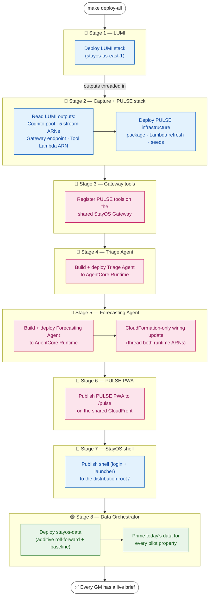

# StayOS — Deployment Pipeline Reference

How the whole StayOS platform gets from `git clone` to a fully populated,
running system with **one command**: `make deploy-all`.

This document explains what that command does, in what order, why the order
matters, and how the pieces are wired together. For the data these stacks read
and write, see [`data-model.md`](data-model.md).

---

## Contents

- [TL;DR](#tldr)
- [Why a single orchestrated command](#why-a-single-orchestrated-command)
- [The pipeline, stage by stage](#the-pipeline-stage-by-stage)
  - [Stage 1 — Deploy LUMI](#stage-1--deploy-lumi)
  - [Stage 2 — Capture LUMI outputs and deploy PULSE initially](#stage-2--capture-lumi-outputs-and-deploy-pulse-initially)
  - [Stage 3 — Register PULSE tools on the shared Gateway](#stage-3--register-pulse-tools-on-the-shared-gateway)
  - [Stage 4 — Build the Triage Agent](#stage-4--build-the-triage-agent)
  - [Stage 5 — Build the Forecasting Agent and wire runtimes](#stage-5--build-the-forecasting-agent-and-wire-runtimes)
  - [Stage 6 — Publish the PULSE PWA](#stage-6--publish-the-pulse-pwa)
  - [Stage 7 — Publish the StayOS shell](#stage-7--publish-the-stayos-shell)
  - [Stage 8 — Deploy the shared Data Orchestrator](#stage-8--deploy-the-shared-data-orchestrator)
- [First run is populated automatically](#first-run-is-populated-automatically)
- [Parameters and configuration](#parameters-and-configuration)
- [Deployment output and logs](#deployment-output-and-logs)
- [How the root Makefile is structured](#how-the-root-makefile-is-structured)
- [Focused voice upgrade](#focused-voice-upgrade)
- [Failure recovery](#failure-recovery)
- [Teardown](#teardown)
  - [Why the order reverses](#why-the-order-reverses)
  - [The teardown, phase by phase](#the-teardown-phase-by-phase)
    - [Phase 1 — Data Orchestrator](#phase-1--data-orchestrator)
    - [Phase 2 — Shell](#phase-2--shell)
    - [Phase 3 — PULSE](#phase-3--pulse)
    - [Phase 4 — LUMI (last)](#phase-4--lumi-last)
  - [Why buckets and ECR are emptied first](#why-buckets-and-ecr-are-emptied-first)
  - [Failure recovery](#failure-recovery-1)
- [Related docs](#related-docs)

---

## TL;DR

```bash
make deploy-all
```

Existing deployments skip the password step and preserve `AppPassword`. For a
new deployment, supply `APP_PASSWORD` through the environment first. See
[password handling](#deployment-password) for creation and intentional replacement.

That single command deploys three things in a fixed order — **LUMI → PULSE →
Data Orchestrator** — because each stage produces values the next stage needs.
PULSE can never be deployed standalone from a clean account: it consumes
outputs produced by the LUMI deploy. The final stage primes today's data, so
every GM has a live daily brief the moment the command finishes.

### Focused pending-fix publication

For the reviewed BUG-010/012/013/016/017 update, use the root
`deploy-pending-fixes` target with explicit `PROFILE`,
`CLOUDFORMATION_PROFILE`, `REGION`, and `EXPECTED_ACCOUNT_ID`.
First run `FIX_PHASE=capture FIX_MANIFEST=/path/to/reviewed-manifest.json`.
The resulting private `logs/pending-fixes-...` directory is the rollback
baseline. Pass it as `FIX_BASELINE` for subsequent phases, in order:
`build`, `backend`, `repair`, `frontends`, and `verify`.

This path preserves existing CloudFormation parameters and the dependency
layer, previews the single mock-mode configuration change, updates only six
selected Lambdas and the two conversational runtimes, and retains all eight
shared Gateway tools. The frontend phase regenerates live configuration and
keeps prior immutable assets during publication. It does not reseed operational
data or publish the shell.

Historical repair requires an existing, unexpired brief and same-date revenue
source. It backs up the original record/audio in the existing encrypted deploy
bucket, preserves historical snapshots and TTLs, generates new audio keys, and
uses conditional writes to refuse concurrent changes. The approved manifest is
bounded to 153 keys; it does not create missing dates. Run `FIX_PHASE=rollback`
with the same baseline to restore the previous deployment and this run's
unchanged repaired records. Keep the baseline until live acceptance checks pass.
Do not mark bugs closed from deployment readiness alone.

The `verify` phase checks published Lambda hashes, DEFAULT runtime versions,
every retained repaired brief against its same-date revenue, preserved
historical snapshots, and the narrative input hash recorded on each new MP3.
Complete authenticated browser and microphone acceptance separately.

If a repair-code correction is required after backend publication, run
`FIX_PHASE=refresh-orchestrator` with the same baseline. It checks the current
code hash before repackaging and updating only the orchestrator. The repair
reads an exact property/date brief through the role's existing strongly
consistent `Query` permission; it does not require an IAM policy change.

<div align="right"><a href="#contents">↑ Back to top</a></div>

---

## Why a single orchestrated command

StayOS is a multi-feature platform, not one stack:

| Component | Stack prefix | Owns |
|-----------|-------------|------|
| **LUMI** | `stayos` | The shared foundation: Cognito user pool, the 5 read-only operational DynamoDB tables (+ their streams), the shared AgentCore Gateway, the shared Tool Lambda, and the CloudFront distribution served at `/`. |
| **PULSE** | `pulse` | The real-time alerting feature: rule evaluator, Triage Agent + Forecasting Agent (AgentCore Runtimes), Action Executor, and the PULSE PWA served at `/pulse`. |
| **Data Orchestrator** | `stayos-data` | The shared, additive roll-forward + PULSE-baseline layer that keeps each property's data current. |

The dependency runs one direction: **PULSE depends on LUMI**, and the **Data
Orchestrator depends on both**. PULSE needs concrete values that only exist
*after* LUMI is deployed:

- the **Cognito user pool** (id, ARN, client id) — for authenticating PULSE users
- the **five operational-table DynamoDB stream ARNs** — the PULSE rule evaluator
  subscribes to these streams to fire alerts
- the **shared AgentCore Gateway endpoint** — PULSE registers its tools here
- the **shared Tool Lambda ARN** — the target PULSE's Gateway tools invoke

Deploying PULSE by hand would mean copying all of those values out of the LUMI
stack outputs and passing them in correctly. `make deploy-all` does exactly that
capture-and-thread step for you, which is why it is the supported path from a
clean account.

<div align="right"><a href="#contents">↑ Back to top</a></div>

---

## The pipeline, stage by stage

`make deploy-all` runs eight numbered stages (echoed as `[n/8]` in the
build log). The flow is a single ordered chain — each stage's output feeds the
next:



### Stage 1 — Deploy LUMI

```
make -C lumi deploy PROFILE=... CLOUDFORMATION_PROFILE=... REGION=... \
    ENVIRONMENT=test EXPECTED_ACCOUNT_ID=...
```

Deploys the LUMI root stack (`stayos-<region>`, e.g. `stayos-us-east-1`) and its
nested stacks — including the `DataStack` that owns the 5 operational tables and
their DynamoDB streams. On creation, `APP_PASSWORD` sets the initial password
for the 5 demo GM accounts; existing-stack redeployments preserve the parameter
without asking for a password. The existing ComputeStack owns the dependency-layer
CodeBuild project and a Lambda-backed custom resource that waits for the build before creating
the layer version. CodeBuild packages the shared layer on Lambda-compatible
Python 3.12 / Amazon Linux / `x86_64` compute, requires binary wheels,
validates its native imports, and writes it to a build-input-fingerprinted S3
key. This produces the same target-compatible Lambda layer from macOS, Linux,
or Windows without a local Docker dependency or another CloudFormation stack.
This is the foundation everything else builds on.

### Stage 2 — Capture LUMI outputs and deploy PULSE initially

The Makefile reads values back out of the deployed LUMI stack using the
CloudFormation `Outputs[?OutputKey=='X'].OutputValue` query pattern:

- `UserPoolId`, `UserPoolClientId`, `ToolLambdaArn` — from the LUMI **root** stack
- the five `*StreamArn` outputs — from the nested **`DataStack`** (its physical
  name is resolved via its fixed logical id `DataStack`)
- `UserPoolArn` — **not** a stack output, so it is derived deterministically from
  `UserPoolId` + region + account id
- the Gateway endpoint URL — read from SSM parameter
  `/stayos/gateway/endpoint-url`

From each stream ARN the Makefile also derives the table ARN and table name
(string-trimming `/stream/...` and `:table/...`) so PULSE can scope its IAM
policies to exactly those tables. All of these are passed into:

```
make -C pulse deploy-initial USER_POOL_ID=... \
    RESERVATIONS_STREAM_ARN=... (…and the rest)
```

This initial PULSE deploy creates or updates infrastructure, builds the backend
package on CodeBuild, refreshes all Lambda functions, and runs the idempotent
seeds. The Triage and Forecast runtimes do not exist yet, so both runtime ARNs
are passed empty.

### Stage 3 — Register PULSE tools on the shared Gateway

```
make -C pulse gateway-deploy TOOL_LAMBDA_ARN=...
```

Registers PULSE's tools on the shared StayOS AgentCore Gateway, pointing them at
LUMI's shared Tool Lambda.

### Stage 4 — Build the Triage Agent

```
make -C pulse triage-deploy
```

Builds and deploys the PULSE Triage Agent to AgentCore Runtime (via CodeBuild —
no local Docker/Finch needed) and writes its runtime ARN to SSM parameter
`/pulse/triage/runtime-arn`. The Makefile validates the parameter and retains
the ARN for the final PULSE update after the Forecasting Agent is also ready.

### Stage 5 — Build the Forecasting Agent and wire runtimes

```
make -C pulse forecast-deploy
```

Builds and deploys the PULSE Forecasting Agent to AgentCore Runtime (via the
same shared CodeBuild project — no local Docker/Finch needed) and writes its
runtime ARN to SSM parameter `/pulse/forecast/runtime-arn`. The deployment
runner reads that ARN back, then invokes the CloudFormation-only
`deploy-runtime-wiring` target, threading in **both** `TRIAGE_RUNTIME_ARN` and
`FORECAST_RUNTIME_ARN` so the per-property
EventBridge scheduler and its `pulse-forecaster-invoker` Lambda can invoke the
Forecasting Agent. The Forecasting Agent is additive and advisory-only: it runs
ahead of the reactive Rule Engine to warn of likely room oversell, and its
runtime execution role (`pulse-forecaster-role-<region>`) is created by the
PULSE stack, so it already exists by the time this stage runs. Waiting until
both runtimes are ready reduces the deployment to two CloudFormation passes.
The wiring pass does **not** rerun CodeBuild, refresh Lambda code, invoke seeds,
or print standalone next-step guidance.

### Stage 6 — Publish the PULSE PWA

```
make -C pulse deploy-frontend USER_POOL_CLIENT_ID=... COGNITO_REGION=...
```

Publishes the PULSE progressive web app to `/pulse` on the **shared LUMI
CloudFront distribution** (PULSE does not own its own distribution).

### Stage 7 — Publish the StayOS shell

```
make -C stayos-shell deploy PROFILE=... REGION=...
```

Builds the StayOS shell (the login + feature-launcher app) and publishes it to
the **root** of the shared distribution (`/`), the front door that ties LUMI and
PULSE together. The sync excludes `lumi/*` and `pulse/*` so it never touches the
feature assets. The shell self-sources its config (Cognito client id, CloudFront
distribution id) from the LUMI stack outputs, so it only needs LUMI to exist —
true by this point. Without this stage the distribution root serves an S3
`AccessDenied` (nothing is published at `/`).

### Stage 8 — Deploy the shared Data Orchestrator

```
make -C shared/data-orchestrator deploy PROFILE=... REGION=... \
    LUMI_STACK_PREFIX=stayos PULSE_STACK_PREFIX=pulse
```

Deploys the shared `stayos-data` stack, wired to the live LUMI table names and
PULSE rule-evaluator stream mappings, and primes today's data for every pilot
property.

**This stage is additive.** It does *not* re-seed or bulk-rewrite the live
dataset — the original seed data and any runtime changes are left untouched. The
priming step is an idempotent, failure-isolated roll-forward: a failure priming
one property does not block the others.

<div align="right"><a href="#contents">↑ Back to top</a></div>

---

## First run is populated automatically

Because Stage 8 primes today's data, **every GM has a current daily brief the
moment `make deploy-all` finishes** — there is no manual "generate the first
brief" step.

Thereafter, one **per-property EventBridge schedule** re-anchors each property's
data window at that property's local midnight, so briefs stay current day to
day.

As a safety net, the VIP-arrivals tool also falls back to a live reservations
query if a brief for the current date is ever missing, so it never reports a
false "no VIP arrivals".

<div align="right"><a href="#contents">↑ Back to top</a></div>

---

## Parameters and configuration

| Variable | Required | Default | Purpose |
|----------|----------|---------|---------|
| `APP_PASSWORD` | Creation or explicit replacement | — | Initial demo password / replacement stack parameter; supply through the environment. Omit on normal updates. |
| `CHANGE_APP_PASSWORD` | No | `0` | Set to `1` with `APP_PASSWORD` to intentionally replace the parameter on an existing stack. Only `0` and `1` are accepted. |
| `PROFILE` | No | default credential chain | Canonical AWS CLI profile / target account. `AWS_PROFILE` remains accepted for compatibility; `PROFILE` wins if both are set. |
| `CLOUDFORMATION_PROFILE` | No | `PROFILE` | Optional role-chain profile used only for CloudFormation operations. It must resolve to the same target account and is useful when organization guardrails exempt a deployment role. |
| `REGION` | No | `us-east-1` | Target AWS region. |
| `ENVIRONMENT` | No | `test` | Logical deployment environment included in planning, reporting, and retries. Existing stack names remain unchanged. |
| `EXPECTED_ACCOUNT_ID` | No | — | Twelve-digit safety guard. Deployment stops before mutations when the resolved account differs. |
| `LUMI_STACK_PREFIX` | No | `stayos` | Stack prefix for LUMI; the LUMI stack name is `${LUMI_STACK_PREFIX}-${REGION}`. |
| `PULSE_STACK_PREFIX` | No | `pulse` | Stack and resource prefix for PULSE. |
| `DATA_STACK_PREFIX` | No | `stayos-data` | Stack and resource prefix for the shared Data Orchestrator. |

```bash
# Redeploy an existing installation, preserving its password
make deploy-all

# A different account / region
make deploy-all PROFILE=my-other-account \
  REGION=us-west-2 ENVIRONMENT=test EXPECTED_ACCOUNT_ID=123456789012

# Target-account profile plus a same-account CloudFormation execution profile
make deploy-all PROFILE=my-target-account \
  CLOUDFORMATION_PROFILE=my-target-cfn-role \
  REGION=us-east-1 ENVIRONMENT=test EXPECTED_ACCOUNT_ID=123456789012

# Read-only account, stack, and stage inspection
make plan PROFILE=my-other-account REGION=us-west-2 \
  ENVIRONMENT=test EXPECTED_ACCOUNT_ID=123456789012
```

### Deployment password

For a **new installation**, use a password with at least 8 characters,
including uppercase, lowercase, and a number. Symbols are allowed but are not
required. Every deployment-context variable in this example is optional:
`PROFILE` selects a configured profile, `CLOUDFORMATION_PROFILE` defaults to
that profile, `REGION` defaults to `us-east-1`, and `EXPECTED_ACCOUNT_ID` adds
an account-safety check.

```bash
printf 'New demo-user password: '; IFS= read -r -s APP_PASSWORD; printf '\n'; APP_PASSWORD="$APP_PASSWORD" make deploy-all PROFILE=my-target-account CLOUDFORMATION_PROFILE=my-target-cfn-role REGION=us-east-1 EXPECTED_ACCOUNT_ID=123456789012; unset APP_PASSWORD
```

Password characters are intentionally invisible while you type; press Enter to
finish. The password is passed only to this deployment, is not written into the
command or shell history, and is removed from the current shell afterward.

For a **normal redeployment**, do not enter the password again. Defensively
clear any old shell variable before using the same optional deployment context:

```bash
unset APP_PASSWORD
make deploy-all
```

The existing `AppPassword` CloudFormation parameter is preserved without
retrieving its value. Supplying `APP_PASSWORD` on an existing stack without
explicit change intent stops deployment before AWS writes rather than silently
replacing it.

To **intentionally replace the stack parameter**, repeat the hidden-input
command and add `CHANGE_APP_PASSWORD=1` after `make deploy-all`, along with any
optional deployment context. This changes the stack parameter, not existing
users' Cognito passwords. The flag requires an existing stack and a nonempty
password. Passwords are never interpolated into generated shell commands or
written to deployment parameter files; AWS CLI receives parameter JSON through
standard input. Avoid command-line password values, which can appear in shell
history and the invoking process's arguments.

The root runner, direct LUMI deployment, and direct infrastructure deployment
share this policy. Both profile identities are verified before inspecting the
stack through `CLOUDFORMATION_PROFILE`. Only an explicit missing-stack response
permits creation. Permission/authentication/network errors, malformed responses,
and existing stacks without `AppPassword` stop deployment. Updates require
`CREATE_COMPLETE`, `UPDATE_COMPLETE`, or `UPDATE_ROLLBACK_COMPLETE`; other
states require recovery first.

**Prerequisites** (one-time): Git, GNU Make, `zip`, AWS CLI v2.27 or later,
Python 3.12 or later with `pip`, Node.js with npm, and AWS credentials configured
for the target account. Node.js must be 22.22.2 or later within 22.x, 24.15.0 or
later within 24.x, or 26.0.0 or later, matching the committed frontend test
dependencies (`^22.22.2 || ^24.15.0 || >=26.0.0`). In the target region, the
deployment identity must be able to use Amazon Bedrock AgentCore and invoke
[Anthropic Claude Sonnet 4.6](https://docs.aws.amazon.com/bedrock/latest/userguide/model-access.html)
and [Amazon Nova 2.5 Sonic](https://aws.amazon.com/about-aws/whats-new/2026/10/amazon-nova-2.5-Sonic/).
Complete Anthropic's first-time-use setup if it applies to the account. StayOS
also uses [Amazon Polly](https://docs.aws.amazon.com/polly/latest/dg/neural-voices.html)
for generated MP3 briefs; Polly is a separate AWS service, not a Bedrock model.
`REGION` defaults to `us-east-1`.

<div align="right"><a href="#contents">↑ Back to top</a></div>

---

## Deployment output and logs

`make deploy-all` uses concise output by default. The root runner exclusively
owns the eight numbered stage headings and translates feature output into
bounded live progress without exposing IDs, ARNs, raw JSON, or upload chatter.
A successful run prints timed stage results, stack verification, application
URLs, asynchronous brief status, total duration, and the log path.

```text
[1/8] LUMI
  … Building or reusing the x86_64 layer in ComputeStack
  … Updating LUMI CloudFormation infrastructure
  … Refreshing LUMI Lambda functions (1/4)
  … Configuring the shared AgentCore Gateway
  … Building the voice runtime image on CodeBuild
  ✓ Foundation, Gateway, runtimes, and frontend ready (8m 42s)
```

Every run writes complete child-command output to
`logs/deploy-<timestamp>.log`. Output modes:

| Setting | Behavior |
|---------|----------|
| default | Concise live progress, timed stages, and summary; diagnostics go to the run log. |
| `VERBOSE=1` | Stream child-command output and include runtime, API, Gateway, and artifact details in the summary. |
| `NO_COLOR=1` | Disable ANSI color. |
| `CI` set | Use stable line-oriented output with no interactive rendering. |

On failure, the runner preserves the failed command's exit code and prints the
stage, the most useful error line, a targeted recovery command, and the run-log
path. Successful commands that emit an unresolved warning are shown as warnings,
not as completed-without-qualification results.

For detailed deployment information outside a run:

```bash
make deployment-summary-detailed PROFILE=... REGION=...
```

<div align="right"><a href="#contents">↑ Back to top</a></div>

---

## How the root Makefile is structured

The root `Makefile` is a **delegator** — it does not build feature code itself.
It forwards prefixed targets to each feature's own Makefile. For `deploy-all`,
it invokes the Python runner under `tools/stayos_deploy`, which owns stage
formatting, logging, output capture, recovery messages, and final verification:

| Pattern | Delegates to | Example |
|---------|-------------|---------|
| `make lumi-<target>` | `make -C lumi <target>` | `make lumi-deploy`, `make lumi-test` |
| `make pulse-<target>` | `make -C pulse <target>` | `make pulse-deploy`, `make pulse-triage-deploy` |
| `make shell-<target>` | `make -C stayos-shell <target>` | `make shell-deploy` |
| `make data-<target>` | `make -C shared/data-orchestrator <target>` | `make data-deploy`, `make data-test` |
| `make plan` | read-only configuration and AWS-state inspection | validates account, region, stack names, and stage order |
| `make deploy-all` | orchestrates LUMI → PULSE → Data Orchestrator | (this document) |
| `make deployment-summary-detailed` | reads runtime, artifact, API, and URL details | read-only AWS inspection |
| `make test-all` | deployment-tool, shared-auth, and feature tests | includes shared-auth tests and type checking |

Run `make help` from the repo root for the full target list. Each feature's own
`README.md` and `Makefile` document its individual targets and internals.

<div align="right"><a href="#contents">↑ Back to top</a></div>

---

## Focused voice upgrade

Use this target to upgrade an existing LUMI voice deployment to Nova Sonic 2.5
(`amazon.nova-2-5-sonic`) without deploying the rest of the platform:

```bash
make lumi-voice-upgrade \
  PROFILE=my-profile CLOUDFORMATION_PROFILE=my-cfn-profile \
  REGION=us-east-1 EXPECTED_ACCOUNT_ID=<target-account-id>
```

Both profiles must resolve to the expected account. The target runs root
`make plan`, checks the model's active status and availability/authorization,
and requires the parent stack, voice nested stack, runtime, and DEFAULT
endpoint to exist and be stable. It uses Python with PyYAML, also used by the
local CloudFormation validation tooling.

Before building, it saves the deployed templates, runtime version, runtime
configuration, and previous image digest under `logs/voice-upgrade-<timestamp>/`.
No CloudFormation parameter values are saved. If the runtime uses a mutable
image tag that changed after its last update, it stops because a reliable
rollback digest cannot be established.

The existing voice CodeBuild project builds first. The runner changes only the
Sonic model ARNs in the deployed voice template, preserving the IAM actions
and region scope. It previews the nested IAM role modification, then changes
only the parent `VoiceStack` template URL. Other nested template references
stay unchanged. Both previews use `aws cloudformation deploy
--no-execute-changeset`; additions, deletions, replacements, unrelated resource
changes, and parameter overrides are rejected before execution. All existing
parameters, including `AppPassword`, use their previous values. Temporary
packaging files stay under the ignored logs directory; no new source template,
stack, or resource is created.

CloudFormation may list unchanged nested stack wrappers with `Automatic`
changes in the parent preview. An additional `create-change-set` preview with
`IncludeNestedStacks` verifies that the only underlying resource change is
`VoiceAgentCoreRole`; any change inside another nested stack stops the run.
This hierarchy preview is deleted without execution. The actual deployment
executes the reviewed change set created by `aws cloudformation deploy`.

The runner updates the existing runtime with the new digest-pinned container,
preserves its configuration, and waits for both the runtime and DEFAULT
endpoint to be READY at the new version. It does not rebuild chat/PULSE agents,
publish frontends, reset passwords, or seed data. A short voice interruption
is possible while the policy and runtime updates are applied.

The voice image uses the GA Strands BidiAgent provider with explicitly pinned
Nova Sonic 2.5 and compatible transport dependencies. This focused target still
does not publish browser changes. When a voice change needs browser updates,
validate and publish only LUMI through its existing frontend targets, with a
separate review of that publication scope.

For a standalone frontend update, run `lumi-write-frontend-env` before
`lumi-build-frontend`, then `lumi-deploy-frontend` and `lumi-invalidate-cdn`
with the same explicit deployment profiles and region. The publish target
uploads the existing build; it does not regenerate configuration. Stale
settings can reject the shared login and cause a redirect loop. A full LUMI
deploy already regenerates these settings before building.

Use `make lumi-voice-description` with the same explicit profiles, region, and
expected account to apply the voice-stack description independently. It previews
only role metadata changes, preserves resource properties and parameters, and
does not build images or update the runtime.

Existing stack tags are explicitly preserved. If a preview stops after a
successful build, rerun the upgrade with `VOICE_BASELINE` pointing to that
run's directory. The saved digest is reused only when the voice source
fingerprint still matches; this avoids another build and keeps the original
rollback image available after the `latest` tag has moved.

Readiness is only the deployment check. Sign in and test connection, spoken
responses and transcripts, property-scoped occupancy/VIP tools, follow-up
context, interruption, shutdown, and reconnection using a live microphone.
Correlate the sessions with runtime logs showing `amazon.nova-2-5-sonic` and
check for model-access, validation, and streaming errors. Also smoke-test the
shell and PULSE.

If a stack/runtime update fails, the runner attempts to restore the saved
voice policy and image digest. For a failed functional test, use the saved
baseline directory explicitly:

```bash
make lumi-voice-rollback VOICE_BASELINE=/absolute/path/to/logs/voice-upgrade-<timestamp> \
  PROFILE=my-profile CLOUDFORMATION_PROFILE=my-cfn-profile \
  REGION=us-east-1 EXPECTED_ACCOUNT_ID=<target-account-id>
```

Rollback updates the existing parent stack through the same guarded
CloudFormation deploy preview and restores the old image as a new runtime
version. Verify the previous voice functionality with the microphone before
calling rollback complete.

## Failure recovery

`deploy-all` is designed so a failure in a later stage does **not** require
redeploying the earlier ones. Each stage prints a targeted re-run command on
failure. In general:

- **LUMI is deployed once** and is healthy after Stage 1 — later failures never
  require redeploying it.
- **PULSE stack failures** can be retried by re-running `make deploy-all` (LUMI
  is skipped-safe because it is already deployed).
- **Individual PULSE steps** (Gateway registration, Triage build, frontend
  publish) each have a standalone re-run command, e.g.
  `make pulse-gateway-deploy PROFILE=... REGION=... TOOL_LAMBDA_ARN=...`.
- **Data Orchestrator failures** are re-runnable with `make data-deploy` and are
  safe because the stage is additive (it does not touch live data).

Every deploy accepts the same canonical context: `PROFILE`, `REGION`,
`CLOUDFORMATION_PROFILE`, `ENVIRONMENT`, `EXPECTED_ACCOUNT_ID`, and stack-prefix
overrides. Keep that context unchanged when retrying. Both profiles are checked
against the same account before deployment; `EXPECTED_ACCOUNT_ID` prevents a
retry from targeting a different account. The successful pipeline ends with
observed stack/runtime/output verification plus a concrete deployment summary.

If CloudFormation is denied by an organization SCP while ordinary target-account
calls work, configure a role-chain profile whose `role_arn` is the approved
same-account deployment role and whose `source_profile` can assume it. Pass that
name as `CLOUDFORMATION_PROFILE`; do not replace `PROFILE`, because the latter
remains the canonical target-account identity for all other deployment calls.

<div align="right"><a href="#contents">↑ Back to top</a></div>

---

## Teardown

`make destroy-all` is the mirror of `make deploy-all`: it tears the whole
platform down with one command, in the **reverse** of the deploy order. It is
destructive and irreversible, so it is guarded by an explicit confirmation.

```bash
# Tear down everything. CONFIRM=DESTROY is required.
make destroy-all CONFIRM=DESTROY

# A different account / region
make destroy-all CONFIRM=DESTROY PROFILE=my-other-account REGION=us-west-2
```

### Why the order reverses

Deploy runs **LUMI → PULSE → Data Orchestrator** because the dependency points
that way (PULSE depends on LUMI; the orchestrator depends on both). Teardown
must therefore run the other way — **Data Orchestrator → shell → PULSE → LUMI** —
so nothing is pulled out from under a still-live consumer. LUMI owns the shared
foundation (Cognito user pool, AgentCore Gateway, shared ECR repos, and the
shared frontend bucket + CloudFront), so it is destroyed **last**.


### The teardown, phase by phase

`make destroy-all` runs four numbered phases (echoed as `══ [n/4] ══`).

#### Phase 1 — Data Orchestrator

```
make -C shared/data-orchestrator destroy PROFILE=... REGION=...
```

Deletes the additive `stayos-data` stack (deployed last, so removed first). The
orchestrator owns no tables, so this is a safe standalone delete. `destroy-all`
adds an explicit `wait stack-delete-complete` after it, because the
orchestrator's own `destroy` target does not wait.

#### Phase 2 — Shell

```
make -C stayos-shell destroy PROFILE=... REGION=...
```

The shell has no infrastructure of its own — it is static files at the **root**
of the shared bucket. So teardown removes only the shell's root objects,
**excluding `/lumi/*` and `/pulse/*`** (the same prefixes deploy excludes), then
invalidates the root cache. In a full teardown this is largely redundant (LUMI's
phase empties the whole bucket next), but it keeps the shell teardown correct for
standalone use.

#### Phase 3 — PULSE

```
make -C pulse destroy PROFILE=... REGION=...
```

Removes only PULSE-owned resources, leaving LUMI's shared foundation intact:

- deletes the **Triage Agent** AgentCore Runtime (CLI-managed, tracked in SSM)
- removes PULSE's **`/pulse` frontend assets** from the shared LUMI bucket
- deletes only the **`triage-latest` image tag** from the shared
  `stayos-chat-agent` ECR repo — never the repo or the chat agent's `:latest`
- empties PULSE's own **deploy bucket** (`pulse-deploy-<account>`)
- deletes the **PULSE stack** and waits for completion

PULSE's Gateway tools live on LUMI's **shared** Gateway target and are not
deregistered here — LUMI's `gateway-destroy` (Phase 4) removes the whole shared
Gateway, and PULSE's tools with it.

#### Phase 4 — LUMI (last)

```
make -C lumi destroy PROFILE=... REGION=...
```

Tears down the shared foundation, in the order CloudFormation needs:

- deletes the **voice + chat AgentCore runtimes** and the shared **AgentCore
  Gateway** (CLI-managed, not part of the stack); Gateway teardown waits until
  every target is absent before requesting Gateway deletion, then verifies the
  Gateway itself is absent before removing its SSM parameters
- **empties the shared frontend + deploy buckets** and **purges the voice/chat
  ECR repos** — CloudFormation cannot delete a non-empty bucket or repository
- deletes the **LUMI stack** and waits for completion (the CloudFront
  distribution removal can take 15+ minutes)

### Why buckets and ECR are emptied first

CloudFormation refuses to delete an S3 bucket that still holds objects or an ECR
repository that still holds images. Each feature's `destroy` therefore empties
its buckets and purges its images **before** calling `delete-stack`, so the stack
delete is not blocked mid-run.

### Failure recovery

Like `deploy-all`, each phase prints a targeted re-run command on failure, and
every phase waits for its stack delete to finish before the next begins:

- **Individual features** can be torn down on their own:
  `make data-destroy`, `make shell-destroy`, `make pulse-destroy`,
  `make lumi-destroy` (honoring each feature's `PROFILE`/`AWS_PROFILE` +
  `REGION`).
- **Order matters for standalone destroys** — `make lumi-destroy` removes the
  shared foundation, so run it only after PULSE and the shell are gone (or use
  `make destroy-all`, which sequences this for you).
- **A stalled stack delete** is usually a non-empty bucket/repo or a lingering
  dependency; inspect it with
  `aws cloudformation describe-stack-events --stack-name <stack>`.

<div align="right"><a href="#contents">↑ Back to top</a></div>

---

## Related docs

- [`data-model.md`](data-model.md) — the shared DynamoDB data model these stacks read and write
- [`../README.md`](../README.md) — platform overview and quick start
- [`../lumi/README.md`](../lumi/README.md) — LUMI internals and per-feature targets
- [`../pulse/README.md`](../pulse/README.md) — PULSE internals and per-feature targets

<div align="right"><a href="#contents">↑ Back to top</a></div>
