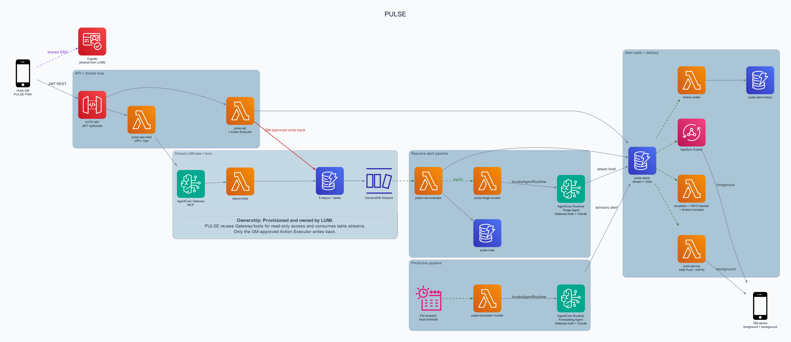

# PULSE — Real-time alerting

Real-time, tiered (**CRITICAL / WARNING / INFO**) AI-triaged alerts pushed to the
GM's device the moment something needs attention — walk risk, a VIP room not
ready, an escalating complaint, an out-of-order room cluster, predicted oversell.
Every CRITICAL action is **closed-loop**: the agent proposes ranked options, the
GM approves one, and PULSE writes the fix back to the data so the condition (and
the alert) clears.

PULSE runs at **`/pulse`** on the shared StayOS CloudFront distribution and reuses
LUMI's Cognito pool, WAF, AgentCore Gateway, and operational data — no new app,
no second login (see the [root README](../README.md) for shell/SSO).

- **Status:** deployed in `us-east-1` (StackPrefix `pulse`).
- **Stack:** serverless, CloudFormation nested stacks, Python 3.12 backend, Next.js PWA.

## Architecture

Two paths feed one alert store (`pulse-alerts`) and one delivery layer.
**Reactive**: a data change fires a rule, which creates an alert and triages it.
**Predictive**: a daily schedule runs the Forecasting Agent ahead of time.
Boxes marked `[LUMI]` are shared-from-LUMI (PULSE reuses, doesn't own).



### Reactive path (data change → resolve)

1. An operational table changes → **DynamoDB Stream** → **`pulse-rule-evaluator`** (one event-source mapping per table).
2. The evaluator loads the property's rules from **`pulse-rules`**, evaluates a safe declarative trigger model (never `eval`), and writes an `UNACKNOWLEDGED` alert to **`pulse-alerts`**.
3. For CRITICAL/WARNING, it **async-invokes `pulse-triage-invoker`** (fire-and-forget, so the stream never blocks), which calls **`InvokeAgentRuntime`** on the **Triage Agent** (Bedrock AgentCore Runtime).
4. The Triage Agent gathers facts via read-only tools over the **shared AgentCore Gateway** (MCP → Tool Lambda), asks **Bedrock (Claude Sonnet, Converse)** to write the brief, attaches a validated `triageBrief` (summary, confidence, 2–5 ranked options) to the alert, and publishes `ALERT_UPDATED`.
5. **Delivery** is dual-channel: **AppSync Events** (foreground WebSocket) for open apps, **Web Push / VAPID** (`pulse-push-service`) for backgrounded ones. INFO alerts are batched; unacknowledged ones escalate via **`pulse-escalation-service`** (EventBridge Scheduler, GM→AGM→MOD).
6. The GM approves an option → `pulse-api` runs the **Action Executor in-process** → one **`TransactWriteItems`** clears the operational condition *and* sets the alert `RESOLVED`. That write-back re-enters via Streams and the rule engine confirms the condition is gone — **closed loop**.

### Predictive path (advisory)

A per-property **EventBridge Scheduler** fires at local midnight → **`pulse-forecaster-invoker`** → **`InvokeAgentRuntime`** on the **Forecasting Agent**. It reads forward-looking signals over the Gateway, runs a **deterministic Forecast Engine** to predict oversell (numbers are never model-generated), has Claude *author* the narrative, and writes an advisory **`FORECAST_OVERSELL`** alert. Advisory-only: it never writes operational data and can't be auto-executed.

### Components

| Component | AWS service | Notes |
|---|---|---|
| PWA at `/pulse` | CloudFront **[LUMI]** | 4 tabs (PULSE / VIPs / Ops / Kitchen) + service worker |
| Auth | Cognito **[LUMI]** | JWT authorizer on the API; AppSync Events auth |
| REST API | API Gateway (HTTP v2) | `pulse-api` (router + Action Executor), `pulse-ops-read` (VIPs/Ops) |
| Alert store | DynamoDB | `pulse-alerts` (+4 GSIs, stream); `pulse-rules`, `pulse-alert-history` (TTL), `pulse-push-subscriptions`, `pulse-kitchen` |
| Source data | DynamoDB **[LUMI]** | 5 `stayos-*` tables w/ Streams |
| Rule engine | Lambda | `pulse-rule-evaluator` (5 stream event-source mappings) |
| Triage / Forecast agents | Bedrock AgentCore Runtime | containers in shared ECR `stayos-chat-agent`; deployed out-of-band |
| Agent tools | AgentCore Gateway (MCP) **[LUMI]** | fronts the shared Tool Lambda |
| Agent reasoning | Amazon Bedrock | Claude Sonnet via Converse |
| Realtime | AppSync Events | `pulse-realtime`, per-property channels |
| Background push | Lambda + Web Push | `pulse-push-service`, VAPID key in Secrets Manager |
| Scheduling | EventBridge Scheduler | per-property forecaster + escalation one-shots |
| Observability | CloudWatch + X-Ray | dashboard, alarms → SNS `pulse-alarms`, log group `/pulse/pipeline` |

Full table schemas: [`../docs/data-model.md`](../docs/data-model.md).

## Project structure

```
pulse/
├── backend/                      # Python 3.12 (src layout)
│   └── src/pulse/
│       ├── api/                  # pulse-api: router, alerts, approvals, rules, subscriptions
│       ├── rule_engine/          # stream-driven rule evaluation
│       ├── triage/               # brief validation
│       ├── escalation/           # GM→AGM→MOD chain
│       ├── delivery/             # AppSync Events publish + Web Push
│       ├── action_executor/      # approved-action write-back (transactional resolve)
│       ├── demo_simulator/       # deterministic scenario mutations (demo only)
│       ├── ops_read/             # pulse-ops-read: /vips, /ops via Gateway MCP
│       └── common/               # models, config, dynamo, logging
│   ├── functions/forecast-invoker/   # Scheduler target → starts a forecaster session
│   └── services/                     # containers for AgentCore Runtime:
│       ├── triage-agent/             #   Triage Agent (Strands)
│       └── forecast-agent/           #   Forecasting Agent (pure engine + AI narrative)
├── frontend/                     # Next.js PWA
└── infrastructure/
    ├── root-stack.yaml
    └── nested-stacks/            # pulse-data · pulse-pipeline · pulse-api · pulse-observability
```

## Build & test

```bash
# backend (from pulse/backend/)
pip install -e '.[dev]' && pytest && ruff check src tests && black --check src tests

# frontend (from pulse/frontend/)
npm install && npm run lint && npm run build && npm run test:run

# infra (from pulse/infrastructure/)
cfn-lint root-stack.yaml nested-stacks/*.yaml
```

## Links

- Unified StayOS REST API contract for LUMI and PULSE: [`../openapi.yaml`](../openapi.yaml)
- Data model: [`../docs/data-model.md`](../docs/data-model.md)
- Deployment pipeline: [`../docs/deployment-pipeline.md`](../docs/deployment-pipeline.md)
